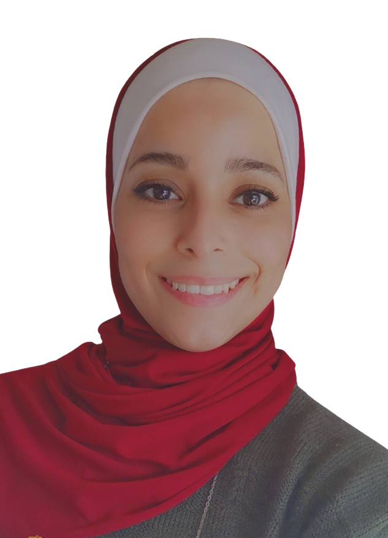

```{r, include=FALSE}
knitr::opts_chunk$set(
  results='asis', 
  echo = FALSE
)

library(glue)
library(tidyverse)
library( pagedown )

# Set this to true to have links turned into footnotes at the end of the document
PDF_EXPORT <- FALSE

# Holds all the links that were inserted for placement at the end
links <- c()

source('parsing_functions.R')

# Load csv with position info
position_data <- read_csv('positions.csv')
```


```{r}
# When in export mode the little dots are unaligned, so fix that. 
if(PDF_EXPORT){
  cat("
  <style>
  :root{
    --decorator-outer-offset-left: -2.5px;
  }
  </style>")
}
```


Aside
================================================================================

{width=100%}

```{r}
# When in export mode the little dots are unaligned, so fix that. 
if(PDF_EXPORT){
  cat("View this CV online with links at _https://sanaz-27.github.io/Sanaz-CV/_")
} else {
  cat("[<i class='fas fa-download'></i> Download a PDF of this CV](https://github.com/nstrayer/cv/raw/master/strayer_cv.pdf)")
}
```

Contact {#contact}
--------------------------------------------------------------------------------

- <i class="fa fa-envelope"></i> sana.zamil@hotmail.com
- <i class="fa fa-twitter"></i> [ZamilSana](https://twitter.com/ZamilSana?t=cnDk857gNIk96MCH0fwlMw&s=09)
- <i class="fa fa-github"></i> [Sanaz](https://github.com/Sanaz-27)
- <i class="fa fa-link"></i> [sanazamil](https://www.linkedin.com/in/sanazamil/)
- <i class="fa fa-phone"></i> (+962)79 726 5182


Software Skills {#skills}
--------------------------------------------------------------------------------

```{r}
skills <- tribble(
  ~skill,               ~level,
  "R",                         3,
  "Javascript (d3.js)",        3,
  "Presentation Softwares",    5,
  "AutoCAD Software",          5,
  "ArcGIS Software",           4.5,
  "Microstation Software",     4,
  "Photoshop",                 4
)

build_skill_bars(skills)
```


Open Source Contributions {#open-source}
--------------------------------------------------------------------------------

- [- **kableExtra Package**](https://rpubs.com/Sanaz/798154) 
- [- **Dashboard**](https://sanazam.shinyapps.io/Final-Project-Dashboard-Abu-Mahfouth/#section-about)


Main
================================================================================

Sana' Zamil {#title}
--------------------------------------------------------------------------------

```{r}
intro_text <- "**This is a sample of my CV, presented as an M.S lab for CPP 527: Foundations of Data Science Part II, at [Arizona State University](https://publicservice.asu.edu/programs/ms/program-evaluation-and-data-analytics-ms), to build templates for R Markdown documents with [Dr.Jesse D. Lecy](https://www.lecy.info/).**"

cat(sanitize_links(intro_text))
```

**Education** {data-icon=graduation-cap data-concise=true}
--------------------------------------------------------------------------------

```{r}
print_section(position_data, 'education')
```

**Work Experience** {data-icon=suitcase}
--------------------------------------------------------------------------------

```{r}
print_section(position_data, 'Work_Experience')
```

<br>
<br>
<br>
<br>
<br>
<br>
<br>

**Volunteer Experience** {data-icon=fingerprint}
--------------------------------------------------------------------------------

::: aside
I have volunteered in a variety of roles. I would love to leave an Impact in this world before I die. 
:::

```{r}
print_section(position_data, 'Volunteer_Experience')
```


**Projects** {data-icon=lightbulb}
--------------------------------------------------------------------------------

::: aside
I have worked in a variety of Projects. 
:::

```{r}
print_section(position_data, 'Projects')
```


```{r}
if(PDF_EXPORT){
  cat("
  
Links {data-icon=link}
--------------------------------------------------------------------------------

<br>


")
  
  walk2(links, 1:length(links), function(link, index){
    print(glue('{index}. {link}'))
  })
}
```

<br>
<br>

::: aside

<br>
<br>
<br>
<br>
<br>

**Made with the R package** [**pagedown**](https://github.com/rstudio/pagedown). 

**Source code:** [github.com/Sanaz-27/Sanaz-CV](https://github.com/Sanaz-27/Sanaz-CV).

**Last updated on** `r Sys.Date()`.
:::


